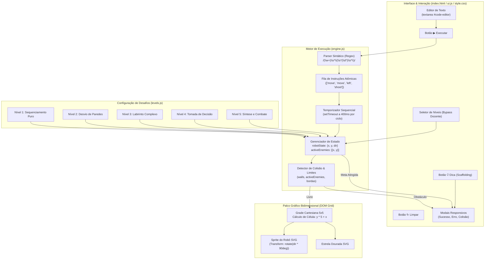

# 📘 Documento Oficial de Análise Técnica & Pedagógica: O Sistema KeyCode e o Complemento da BNCC em Computação

---

**Instituição:** Instituto Federal de Educação, Ciência e Tecnologia de São Paulo (IFSP) – Câmpus Catanduva  
**Curso:** Superior de Tecnologia em Análise e Desenvolvimento de Sistemas (TADS)  
**Componente Curricular:** CTDPEX1 — Projeto de Extensão 1 (1º Semestre de 2026)  
**Orientador:** Prof. Me. Fábio Luiz Viana  
**Autores:** Ryan Cantareli de Aguiar & Pedro Henrique Oliveira Pereira  
**Referência Normativa Principal:** *Normas sobre Computação na Educação Básica – Complemento à BNCC (Parecer CNE/CP nº 2/2022 e Resolução CNE/CP nº 1/2022)*  
**Sistema Analisado:** Plataforma Gamificada de Programação Textual *KeyCode*

---

## 1. Sumário Executivo e Diagnóstico de Faixa Etária

O projeto **KeyCode** nasceu com a proposta extensionista inicial voltada ao público infantil do 3º ano do Ensino Fundamental (Escola Municipal "Mário Florence"). Contudo, uma análise aprofundada da sua arquitetura, sintaxe textual e exigências cognitivas demonstra que o sistema **ultrapassa amplamente os limites dos anos iniciais** e encontra seu **ponto de máxima aderência curricular ("Sweet Spot") entre o 6º e o 9º ano do Ensino Fundamental (11 a 15 anos)**, além de servir como ferramenta primorosa de nivelamento no **Ensino Médio e Técnico**.

```
                   MATURIDADE COGNITIVA & ADERÊNCIA CURRICULAR AO KEYCODE
┌────────────────────────┬──────────────────────────────────┬─────────────────────────────────┐
│  1º ao 3º Ano (6-8a)   │       4º e 5º Ano (9-10a)        │       6º ao 9º Ano (11-15a)     │
├────────────────────────┼──────────────────────────────────┼─────────────────────────────────┤
│ ⚠️ Uso Assistido        │ 🟢 Transição Ideal                │ 🌟 Ápice de Aderência (Sweet)   │
│ Alta dependência motora│ Domínio pleno do teclado;        │ Sintaxe textual real;           │
│ e cognitiva para achar │ consolidação de matrizes (x,y)   │ parametrização e funções;       │
│ parênteses e sintaxe.  │ e raciocínio de descentração.    │ depuração investigativa de erros│
└────────────────────────┴──────────────────────────────────┴─────────────────────────────────┘
```

### Por que o sistema se destaca a partir do 5º/6º ano?
1. **Superação da Barreira dos Blocos (Arrastar e Soltar):** O documento da BNCC prevê que, a partir do 6º ano (`EF06CO02`), os alunos migrem de atividades puramente desplugadas ou de blocos visuais para **linguagens de programação formais com comandos textuais precisos**.
2. **Descentração Espacial e Geometria Relativa:** A navegação do robô exige rotações relativas ao próprio agente (`virarDireita()` toma como base a frente do robô, e não os olhos do jogador na tela). Essa habilidade de descentração espacial atinge seu amadurecimento pleno conforme o estágio operatório formal (Piaget), consolidado dos 10 aos 12 anos.
3. **Parametrização Algorítmica:** O comando `mover(n)` materializa o conceito de parâmetro e generalização de repetições, trabalhado expressamente nas habilidades de 6º ano (`EF06CO06`).
4. **Ciclo Reflexivo de Depuração (*Debugging*):** A análise minuciosa de falhas (colisão com paredes, rotas incompletas) estimula o pensamento crítico e a depuração autônoma preconizados no 7º ano (`EF07CO02`).

---

## 2. Engenharia e Funcionamento Detalhado do Sistema

O KeyCode foi projetado com arquitetura modular em *Vanilla JavaScript (ES Modules)*, sem sobrecarga de frameworks, garantindo execução fluida em computadores de laboratórios de escolas públicas:



### Principais Módulos do Sistema:
* **[index.html](file:///c:/Users/pedro/Documents/ProjetoDeExtensão/ProjetoDeExtensão/index.html):** Organização em *Split-Screen* (Painel de Código à esquerda e Tabuleiro à direita), permitindo simultaneidade entre a elaboração mental do código e a observação do fenômeno simulado.
* **[js/engine.js](file:///c:/Users/pedro/Documents/ProjetoDeExtensão/ProjetoDeExtensão/js/engine.js):**
  - **Parser Léxico/Sintático:** Normaliza o código (`toLowerCase()`) e extrai tokens via Expressão Regular:
    ```javascript
    const commandRegex = /(\w+)\s*\(\s*(\d*)\s*\)/;
    ```
  - **Desdobramento de Iterações:** Se o comando for `mover(4)`, a engine expande a instrução para quatro microações `'move'` sequenciais, ensinando o princípio da iteração definida.
  - **Orientação Angular Modular ($\mathbb{Z}_4$):** Gerencia a rotação do robô através de aritmética modular:
    $$\text{virarDireita} \implies \text{dir} = (\text{dir} + 1) \pmod 4$$
    $$\text{virarEsquerda} \implies \text{dir} = (\text{dir} + 3) \pmod 4$$
    O ângulo em graus é atualizado no elemento visual via CSS: `robotElement.style.transform = rotate(${robotState.dir * 90}deg)`.
  - **Loop de Execução e Temporalidade:** Cada instrução é executada a cada 400ms. Esse intervalo é didaticamente planejado para permitir o rastreamento visual passo a passo do algoritmo em execução.
  - **Mecânica de Ação no Ambiente:** O comando `atirarNaFrente()` detecta o vetor de projeção ortogonal; se houver um inimigo na coordenada adjacente imediata, remove o objeto da lista de ameaças ativas.
* **[js/levels.js](file:///c:/Users/pedro/Documents/ProjetoDeExtensão/ProjetoDeExtensão/js/levels.js):** Contém a matriz de estados de cada fase com tamanho de grid, posição inicial do robô, vetor do objetivo, coordenadas de paredes (`walls`), coordenadas de inimigos (`enemies`) e textos de apoio contextual (*hints*).
* **[js/ui.js](file:///c:/Users/pedro/Documents/ProjetoDeExtensão/ProjetoDeExtensão/js/ui.js) & [js/main.js](file:///c:/Users/pedro/Documents/ProjetoDeExtensão/ProjetoDeExtensão/js/main.js):** Gerenciam o ciclo de vida dos eventos, modais de incentivo e a mediação da interface com o usuário.

---

## 3. Mapeamento Exaustivo na BNCC Computação

O documento oficial divide a Computação em três eixos: **Pensamento Computacional**, **Mundo Digital** e **Cultura Digital**. A seguir, detalha-se cada habilidade contemplada pelo KeyCode com o texto oficial da norma, sua fundamentação didática e a correspondência exata no sistema.

---

### 3.1. Eixo: PENSAMENTO COMPUTACIONAL (PC)

#### 🔸 Habilidades dos Anos Finais (6º ao 9º Ano) — Núcleo Principal do KeyCode

---

##### 📌 **(EF06CO02)** — Elaboração de Algoritmos em Linguagem de Programação
> **Texto Oficial da BNCC:**  
> *"Elaborar algoritmos que envolvam instruções sequenciais, de repetição e de seleção usando uma linguagem de programação."*
* **Explicação do Documento da BNCC (pág. 43):**  
  Existem diferentes linguagens de programação que podem ser usadas para descrever algoritmos em diferentes níveis de abstração. O aluno precisa compreender que o programa é uma descrição formal de um algoritmo em uma linguagem interpretável.
* **Como o KeyCode atende no código:**  
  O KeyCode utiliza uma linguagem textual interpretada no arquivo [engine.js](file:///c:/Users/pedro/Documents/ProjetoDeExtensão/ProjetoDeExtensão/js/engine.js#L112-L140). O estudante não arrasta caixas; ele digita as instruções sequenciais no editor, como:
  ```text
  mover(2)
  virarDireita()
  mover(3)
  ```
  Ao clicar em executar, a linguagem traduz os comandos em rotinas lógicas reais.

---

##### 📌 **(EF06CO03)** — Precisão na Resolução e Construção de Programas
> **Texto Oficial da BNCC:**  
> *"Descrever com precisão a solução de um problema, construindo o programa que implementa a solução descrita."*
* **Explicação do Documento da BNCC (pág. 43):**  
  O aluno deve expressar a solução do problema com rigor sintático e lógico, compreendendo que qualquer imprecisão ou ambiguidade inviabiliza a execução correta pela máquina.
* **Como o KeyCode atende no código:**  
  O parser do KeyCode exige estrita precisão: erros como digitar `mover 4` (sem parênteses) ou esquecer o nome correto da instrução impedem o robô de agir. A criança compreende que o computador é determinístico e exige comunicação sem ambiguidades.

---

##### 📌 **(EF06CO04)** — Decomposição Automatizada em Programação
> **Texto Oficial da BNCC:**  
> *"Construir soluções de problemas usando a técnica de decomposição e automatizar tais soluções usando uma linguagem de programação."*
* **Explicação do Documento da BNCC (pág. 43):**  
  Decomposição é dividir um problema em partes menores, resolvê-las independentemente e combiná-las para solucionar o todo.
* **Como o KeyCode atende no código:**  
  No **Nível 3 (O Labirinto)** e no **Nível 5 (Inimigo à Frente)**, a travessia não pode ser resolvida de uma só vez. O estudante precisa decompor o desafio em: (1) alcançar a primeira curva; (2) reorientar o robô; (3) contornar a parede interna; (4) atirar no inimigo; e (5) avançar até a estrela. Cada subsolução é uma linha de código articulada no script final.

---

##### 📌 **(EF06CO06)** — Uso de Parâmetros e Variáveis para Generalização
> **Texto Oficial da BNCC:**  
> *"Comparar diferentes casos particulares (instâncias) de um mesmo problema (...) e criar um algoritmo para resolver todos, fazendo uso de variáveis (parâmetros) para permitir o tratamento de todos os casos de forma genérica."*
* **Explicação do Documento da BNCC (pág. 43):**  
  Para descrever um algoritmo de forma genérica, é fundamental atribuir parâmetros às instruções, permitindo que a mesma rotina execute magnitudes de tarefas diferentes.
* **Como o KeyCode atende no código:**  
  A instrução `mover(n)` e `virarDireita(n)` implementa a passagem direta de argumentos para a função:
  - `mover(1)` move uma casa;
  - `mover(4)` reutiliza a rotina de deslocamento por quatro iterações.  
  Isso ensina concretamente a diferença entre a função (ação) e seu parâmetro (argumento de entrada).

---

##### 📌 **(EF07CO02)** — Análise e Depuração de Programas (*Debugging*)
> **Texto Oficial da BNCC:**  
> *"Analisar programas para detectar e remover erros, ampliando a confiança na sua correção."*
* **Explicação do Documento da BNCC (pág. 47):**  
  *"Deve-se estimular a análise crítica do programa construído. Uma das formas é através da depuração, que consiste em uma análise detalhada do código e realização de testes para identificar erros. Depuração é uma das formas de desenvolver a habilidade do pensamento crítico."*
* **Como o KeyCode atende no código:**  
  Implementado no fluxo de validação de [engine.js:193-198](file:///c:/Users/pedro/Documents/ProjetoDeExtensão/ProjetoDeExtensão/js/engine.js#L193-L198) e [ui.js:46-52](file:///c:/Users/pedro/Documents/ProjetoDeExtensão/ProjetoDeExtensão/js/ui.js#L46-L52). Se o aluno calcula um passo a mais e o robô atinge uma barreira, a engine interrompe o movimento, congela a tela e abre o modal:  
  `🧱 Cuidado! Você bateu em um obstáculo!`.  
  O aluno então precisa reler seu código, rastrear a linha onde ocorreu o excesso de passos e testar novamente até atingir a correção.

---

##### 📌 **(EF09CO03)** — Autômatos e Linguagens Orientadas a Eventos
> **Texto Oficial da BNCC:**  
> *"Usar autômatos para descrever comportamentos de forma abstrata automatizando-os através de uma linguagem de programação baseada em eventos."*
* **Explicação do Documento da BNCC (pág. 57):**  
  Modelar estados do sistema e as transições possíveis a partir da ocorrência de eventos (cliques, temporizadores, sinais de colisão).
* **Como o KeyCode atende no código:**  
  O robô do KeyCode é um autômato de estados finitos modelado matematicamente com os estados de direção ($0$: Norte, $1$: Leste, $2$: Sul, $3$: Oeste). A transição de estado ocorre orientada a eventos disparados pelo temporizador da fila de comandos e pela escuta de botões no [main.js](file:///c:/Users/pedro/Documents/ProjetoDeExtensão/ProjetoDeExtensão/js/main.js#L14-L16).

---

#### 🔸 Habilidades dos Anos Iniciais (1º ao 5º Ano) — Base Introdutória

---

##### 📌 **(EF01CO02)** e **(EF01CO03)** — Sequências e Conceituação de Algoritmos
> **Texto Oficial da BNCC:**  
> *"Identificar e seguir sequências de passos aplicados no dia a dia para resolver problemas"* e *"Reorganizar e criar sequências de passos em meios físicos ou digitais, relacionando essas sequências à palavra 'Algoritmos'."*
* **Aplicação no KeyCode:**  
  O Nível 1 introduz o estudante à necessidade de uma sequência cronológica estrita para atingir um propósito no meio digital.

##### 📌 **(EF02CO02)** — Repetições Simples (Iterações Definidas)
> **Texto Oficial da BNCC:**  
> *"Criar e simular algoritmos (...) construídos como sequências com repetições simples (iterações definidas) com base em instruções preestabelecidas (...), analisando como a precisão da instrução impacta na execução do algoritmo."*
* **Aplicação no KeyCode:**  
  O uso da sintaxe com contagem definida (`mover(4)`) demonstra que uma única linha de comando pode expressar múltiplas repetições idênticas sem redundância de código.

##### 📌 **(EF03CO01)** e **(EF03CO02)** — Lógica Computacional e Tomada de Decisão
> **Texto Oficial da BNCC:**  
> *"Associar os valores 'verdadeiro' e 'falso' a sentenças lógicas..."* e *"Criar e simular algoritmos (...) com condição para resolver problemas..."*
* **Aplicação no KeyCode:**  
  No Nível 4 ("Atirar ou desviar?"), o aluno avalia a condição: se a linha reta contém uma ameaça, ele pode optar por destruir a ameaça com `atirarNaFrente()` ou tomar uma rota ortogonal de desvio.

##### 📌 **(EF04CO01)** — Organização Espacial em Matrizes e Coordenadas
> **Texto Oficial da BNCC:**  
> *"Reconhecer objetos do mundo real e/ou digital que podem ser representados através de matrizes que estabelecem uma organização na qual cada componente está em uma posição definida por coordenadas..."*
* **Aplicação no KeyCode:**  
  A grade é gerada dinamicamente via CSS Grid no [engine.js:30-37](file:///c:/Users/pedro/Documents/ProjetoDeExtensão/ProjetoDeExtensão/js/engine.js#L30-L37). Cada célula corresponde exatamente a um par ordenado $(X, Y)$ no plano cartesiano bidimensional, trabalhando a relação entre álgebra, geometria e indexação computacional.

##### 📌 **(EF15CO02)** — Construção de Algoritmos no Ciclo 1º ao 5º Ano
> **Texto Oficial da BNCC:**  
> *"Construir e simular algoritmos, de forma independente ou em colaboração, que resolvam problemas simples e do cotidiano com uso de sequências, seleções condicionais e repetições de instruções."*
* **Aplicação no KeyCode:**  
  Constitui o próprio núcleo de jogabilidade da ferramenta em todos os seus 5 níveis.

---

### 3.2. Eixo: MUNDO DIGITAL (MD)

---

##### 📌 **(EF02CO03)** — Conjunto de Instruções de Máquina
> **Texto Oficial da BNCC:**  
> *"Identificar que máquinas diferentes executam conjuntos próprios de instruções e que podem ser usadas para definir algoritmos."*
* **Explicação do Documento da BNCC (pág. 21):**  
  Compreender que o computador não interpreta livremente o pensamento humano; ele disponibiliza um conjunto restrito de operações básicas primitivas.
* **Aplicação no KeyCode:**  
  O aluno aprende que o robô não aceita comandos livres como "vá para frente", mas responde estritamente ao seu vocabulário operacional: `mover`, `virarDireita`, `virarEsquerda` e `atirarNaFrente`.

##### 📌 **(EF02CO04)** — Hardware versus Software
> **Texto Oficial da BNCC:**  
> *"Diferenciar componentes físicos (hardware) e programas que fornecem as instruções (software) para o hardware."*
* **Aplicação no KeyCode:**  
  A interface separa nitidamente o **agente atuador** (o robô no grid) e o **programa de controle** (o texto digitado no editor). O aluno constata que o robô permanece estático até que um software forneça instruções de execução.

##### 📌 **(EF03CO06)** — Interfaces Físicas de Entrada e Saída (I/O)
> **Texto Oficial da BNCC:**  
> *"Reconhecer que, para um computador realizar tarefas, ele se comunica com o mundo exterior com o uso de interfaces físicas (dispositivos de entrada e saída)."*
* **Aplicação no KeyCode:**  
  A dinâmica prática do jogo reforça o fluxo contínuo de entrada (digitação no teclado e cliques no mouse) processada pela CPU e exibida nos dispositivos de saída (monitor, com renderização de estados visuais).

---

### 3.3. Eixo: CULTURA DIGITAL (CD)

---

##### 📌 **(EF03CO08)** e **(EF15CO08)** — Uso de Ferramentas Computacionais Didáticas
> **Texto Oficial da BNCC:**  
> *"Usar ferramentas computacionais em situações didáticas para se expressar em diferentes formatos digitais"* e *"Reconhecer e utilizar tecnologias computacionais para (...) resolver problemas."*
* **Aplicação no KeyCode:**  
  Transforma o laboratório de informática escolar de um espaço de mero consumo passivo (navegação na web ou exibição de vídeos) em uma **oficina de autoria e criação ativa de soluções**.

##### 📌 **(EF05CO10)** e **(EF06CO10)** — Tecnologia, Trabalho e Autonomia
> **Texto Oficial da BNCC:**  
> *"Expressar-se crítica e criativamente na compreensão das mudanças tecnológicas no mundo do trabalho..."*
* **Aplicação no KeyCode:**  
  Aproxima os jovens da realidade profissional do mercado de software, desmistificando a profissão de desenvolvedor através de uma ferramenta de codificação real.

---

### 3.4. Relação com as Competências do Ensino Médio

No Ensino Médio, o KeyCode se alinha aos objetivos de **Engenharia de Software e Avaliação de Usabilidade**:
* **(EM13CO02):** Refinamento vertical e horizontal de software a partir de protótipos evolutivos.
* **(EM13CO06) e (EM13CO15):** Avaliação de software com base em métricas de usabilidade, eficiência e experiência do usuário (UX), princípios seguidos no design acessível e no baixo consumo de memória do KeyCode.

---

## 4. Matriz Curricular Consolidada dos Níveis do KeyCode

A tabela abaixo correlaciona as fases do jogo com os objetivos pedagógicos oficiais:

| Nível / Desafio | Configuração e Obstáculos | Comandos Mobilizados | Foco Conceitual | Código BNCC Principal |
| :--- | :--- | :--- | :--- | :--- |
| **Nível 1:** Primeiros Passos | Grid 5x5 livre. Distância linear de 4 casas. | `mover(4)` ou `mover()` x4 | Sequenciamento linear e parâmetro de repetição definida. | **EF01CO02**, **EF02CO02**, **EF06CO06** |
| **Nível 2:** Cuidado com as Paredes | Paredes ortogonais bloqueando linha reta em $(2,4)$, $(2,3)$, $(2,2)$. | `mover(n)`, `virarDireita()`, `virarEsquerda()` | Geometria plana, rotação relativa em $\mathbb{Z}_4$ e quebra de linearidade. | **EF03CO03**, **EF04CO01**, **EF06CO02** |
| **Nível 3:** O Labirinto | Corredor sinuoso com 8 blocos de parede em zigue-zague. | Encadeamento múltiplo de giros e avanços parametrizados. | Decomposição algorítmica de trajeto e rastreamento espacial complexo. | **EF03CO03**, **EF06CO04**, **EF07CO02** |
| **Nível 4:** Atirar ou Desviar? | Inimigo bloqueando rota rápida em $(2,2)$ com paredes laterais. | `atirarNaFrente()`, `mover(n)`, giros angulares | Tomada de decisão, caminhos alternativos e manipulação de estado do meio. | **EF03CO01**, **EF05CO04**, **EF06CO02** |
| **Nível 5:** Inimigo à Frente! | Dois inimigos e 8 paredes formando barreiras táticas. | Síntese de todos os comandos da linguagem. | Integração global de competências, autômato de estados e depuração crítica. | **EF06CO03**, **EF07CO02**, **EF09CO03** |

---

## 5. Fundamentação Pedagógica e Psicológica

```
                         ZONA DE DESENVOLVIMENTO PROXIMAL (Vygotsky)
 ┌───────────────────────────┬───────────────────────────────┬───────────────────────────┐
 │ Nível de Desenv. Real     │ Zona Proximal (Andaime)       │ Nível de Desenv. Potencial│
 │ O aluno já compreende     │ O sistema oferece o botão de  │ O aluno programa rotinas  │
 │ sequências e digitação    │ "💡 Dica" e modais de erro    │ complexas e contorna      │
 │ simples.                  │ explicativos sem frustrar.    │ labirintos com autonomia. │
 └───────────────────────────┴───────────────────────────────┴───────────────────────────┘
```

1. **Construcionismo (Seymour Papert):** O robô digital atua como entidade mediadora para a concretização de conceitos abstratos de matemática e lógica. O erro deixa de ser punição e passa a ser evidência objetiva a ser investigada pelo aprendiz.
2. **Zona de Desenvolvimento Proximal e Scaffolding (Lev Vygotsky):** O sistema oferece suporte calibrado: mensagens claras de colisão em vez de travamentos silenciosos e um botão de dica contextual que guia sem fornecer a resposta pronta.
3. **Taxonomia de Bloom Revisada:** O educando é conduzido da memorização da sintaxe até a análise de rotas alternativas e criação independente do algoritmo.

---

## 6. Conclusão e Recomendações Extensionistas

1. **Adequação Curricular:** Embora o KeyCode possa ser utilizado no 3º ano sob forte mediação docente, a sua **excelência pedagógica plena ocorre nas turmas de 5º ao 8º ano (10 a 14 anos)**, onde a fluência de digitação e a capacidade de abstração textual maximizam o rendimento dos estudantes.
2. **Relevância para a Escola Pública:** A ausência de dependências pesadas e a execução local no navegador tornam o KeyCode perfeitamente adaptado à infraestrutura real das escolas municipais brasileiras.
3. **Cumprimento do Complemento à BNCC:** O sistema cobre de ponta a ponta os três eixos da BNCC Computação, constituindo um modelo exemplar de integração entre universidade pública (IFSP Catanduva) e educação básica comunitária.
