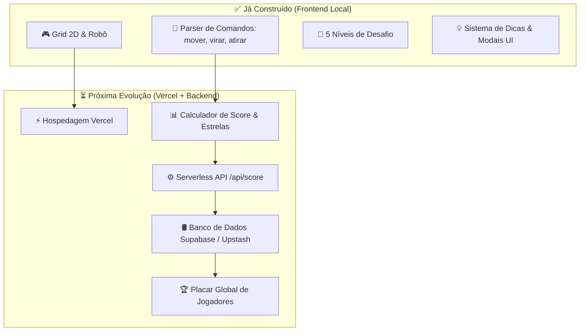

# 🗺️ Mapa Mental & Roadmap Técnico: KeyCode 🚀

Como **Tech Lead** do projeto **KeyCode**, revisei todo o código-fonte atual da aplicação (`index.html`, `js/engine.js`, `js/levels.js`, `js/ui.js`, `js/main.js`, `css/style.css`). 

Este **Mapa Mental** reflete com precisão **o que já está construído no código** (marcado com ✅) e **os próximos passos de evolução** (marcados com ⏳ ou 🔄).

---

## 📌 Status Atual do Projeto & Arquitetura Alvo



---

## 🌳 Mapa Mental Atualizado do Projeto

```
KeyCode 🚀
│
├── ✅ MÓDULO BASE DO JOGO (Implementado no Código)
│   ├── ✅ Engine do Grid 2D (`js/engine.js`)
│   │   ├── Movimentação do robô em 4 direções (Cima, Direita, Baixo, Esquerda)
│   │   ├── Detecção de colisão com bordas e paredes (`walls`)
│   │   └── Destruição de inimigos (`enemies`) via comando `atirarNaFrente()`
│   ├── ✅ Interpretador de Código / Sintaxe (`js/engine.js`)
│   │   └── Comandos: `mover(n)`, `virarDireita(n)`, `virarEsquerda(n)`, `atirarNaFrente()`
│   ├── ✅ 5 Níveis de Aprendizado (`js/levels.js`)
│   └── ✅ Interface de Usuário & Modais (`index.html`, `js/ui.js`, `css/style.css`)
│       ├── Seletor de nível e painel de instrução
│       ├── Modais de Vitória, Colisão e Dicas por Nível
│       └── Layout responsivo com CSS moderno
│
├── 📍 FASE 1: Preparação & Deploy na Vercel (Próximo Passo)
│   ├── 🔄 Repositório GitHub Sincronizado
│   ├── ⏳ Configuração do Deploy Automático na Vercel (Static Hosting)
│   └── ⏳ Validação do link público web
│
├── 🎮 FASE 2: Sistema de Pontuação Local & Melhorias no Gameplay
│   ├── ⏳ Calculador de Pontuação Local (Score Engine)
│   │   ├── Pontos base por nível concluído
│   │   ├── Bônus de eficiência (menos linhas de código / movimentos)
│   │   └── Penalidade pelo uso de dicas
│   ├── ⏳ Sistema de Estrelas (1 a 3 estrelas por nível)
│   ├── ⏳ Salvamento do Progresso no Navegador (`localStorage`)
│   ├── ⏳ Desbloqueio Sequencial de Níveis (desbloquear nível 2 ao vencer nível 1)
│   ├── ⏳ Efeitos Sonoros (Áudio de passos, tiro, vitória e erro + Mute Toggle)
│   └── ⏳ Novos Comandos Avançados (ex: `repetir(n) { ... }`)
│
├── 🛢️ FASE 3: Backend, Banco de Dados & Autenticação
│   ├── ⏳ Escolha do Banco de Dados em Nuvem
│   │   ├── Opção Recomendada: Supabase (PostgreSQL - Free Tier, Autenticação + DB)
│   │   └── Opção Alternativa: Upstash Redis (Ranking ultra-rápido via ZSET)
│   ├── ⏳ Modal de Registro de Apelido (Nickname) do Jogador
│   └── ⏳ Criar Vercel Serverless Functions (`/api/submit-score`, `/api/leaderboard`)
│
├── 🏆 FASE 4: Placar Global (Leaderboard UI) & Recursos Sociais
│   ├── ⏳ Tela/Modal de Ranking Global (Top 10 Melhores Pontuações)
│   ├── ⏳ Ranking de Pontuação Geral & Ranking por Nível
│   └── ⏳ Conquistas e Badges ("Mestre da Lógica", "Sem Dicas")
│
└── 🚀 FASE 5: Polimento, Segurança & Analytics
    ├── ⏳ Validação Anti-Cheat no Servidor (evitar envios manuais fraudulentos de score)
    ├── ⏳ Vercel Analytics para métricas de acessos
    └── ⏳ Domínio personalizado / Divulgação
```

---

## 📋 Diagnóstico Técnico do Código Atual

| Arquivo | Responsabilidade Atual | O que precisa ser adicionado para a Pontuação/Vercel? |
| :--- | :--- | :--- |
| [index.html](file:///c:/Users/pedro/OneDrive/ProjetoDeExtensão/index.html) | Estrutura HTML do editor, grid e modais | Adicionar botão/modal do **Ranking Global**, campo de **Apelido** e indicador de **Pontuação/Estrelas** |
| [js/engine.js](file:///c:/Users/pedro/OneDrive/ProjetoDeExtensão/js/engine.js) | Lógica de movimentação, colisão e execução | Adicionar o **cálculo de pontos**, contador de comandos e gatilho de envio de score |
| [js/levels.js](file:///c:/Users/pedro/OneDrive/ProjetoDeExtensão/js/levels.js) | Definição dos 5 níveis atuais | Adicionar meta de linhas ideais (`parCodeLines`) por nível para calcular o bônus de eficiência |
| [js/ui.js](file:///c:/Users/pedro/OneDrive/ProjetoDeExtensão/js/ui.js) | Manipulação de elementos visuais e modais | Renderizar estrelas ganhas e a **tabela de classificação do Placar Global** |
| [js/main.js](file:///c:/Users/pedro/OneDrive/ProjetoDeExtensão/js/main.js) | Event Listeners e inicialização | Integrar novos ouvintes para abrir o Ranking e salvar o progresso |

---

## 🚦 Recomendação do Tech Lead para os Próximos Passos

Agora que o mapa mental reflete exatamente o que temos pronto, temos duas opções claras de ação:

1. 🌐 **Opção 1 (Deploy Vercel):** Preparar o repositório no GitHub (se ainda não estiver publicamente vinculado) e realizar o primeiro deploy estático na Vercel.
2. 📊 **Opção 2 (Pontuação & Estrelas no Jogo):** Criar primeiro o sistema de pontuação local e exibição de estrelas nos modais de vitória antes de conectar o banco de dados.

Como gostaria de proceder?
